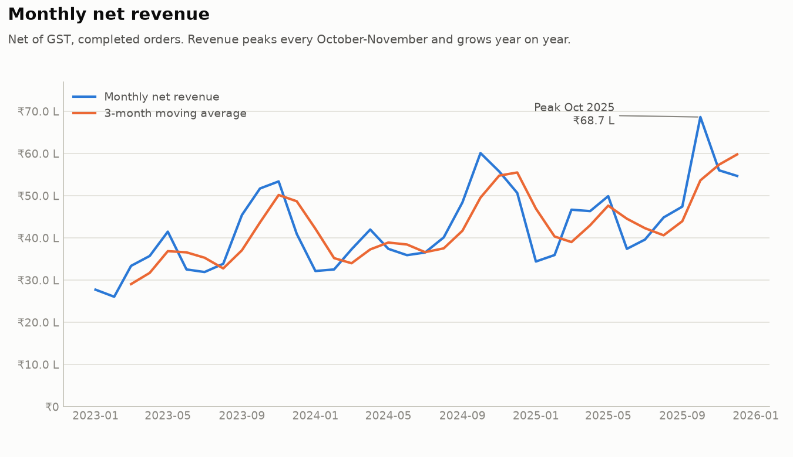
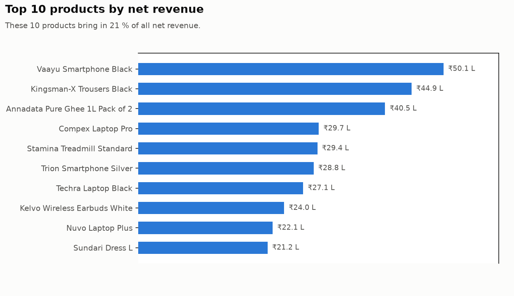
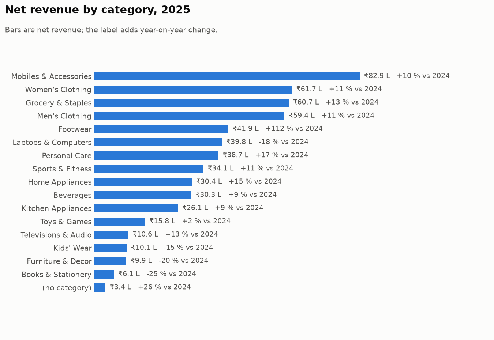
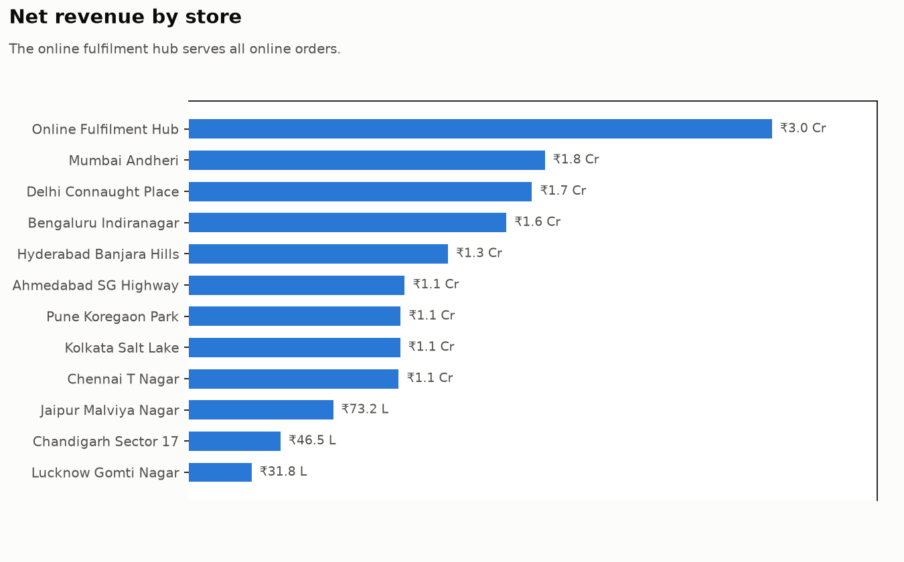
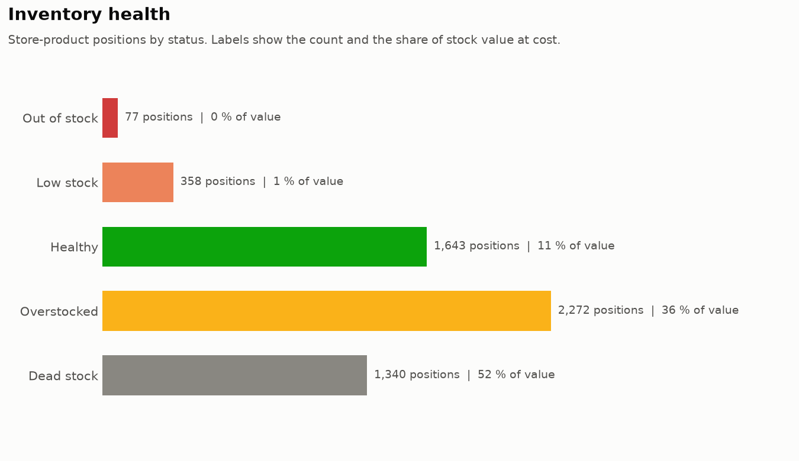
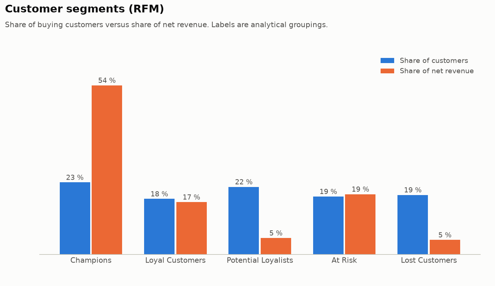
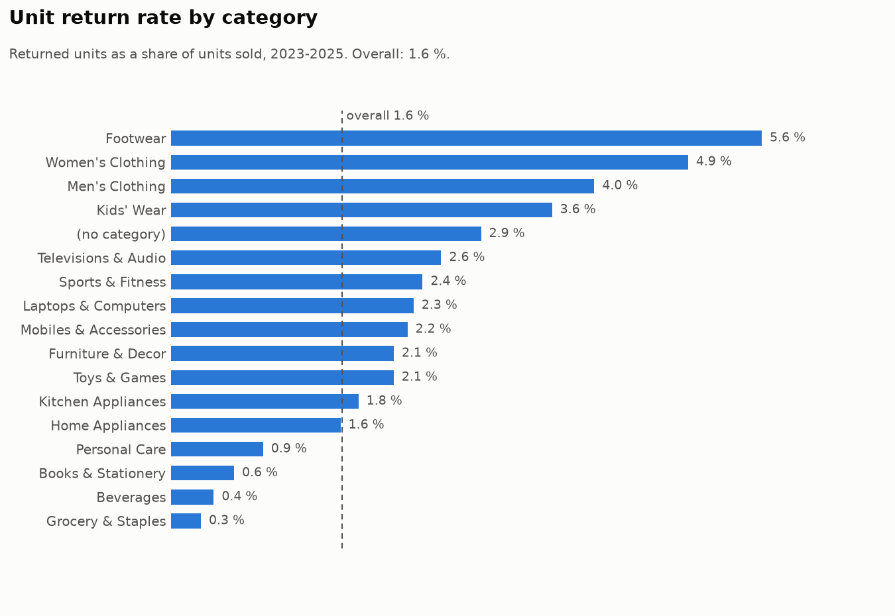
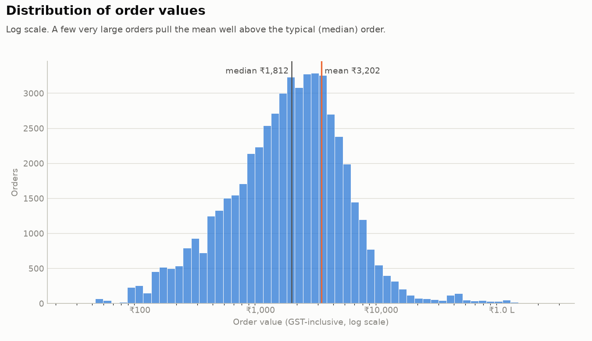

# Retail Sales & Inventory Analytics System

An end-to-end analytics project for a fictional Indian retailer: a normalised **PostgreSQL** database, a reproducible **synthetic data generator**, **143 analytical SQL queries**,
reusable KPI **views**, **measured** index tuning, **Python** analysis and charts, a **Power BI** specification, and **350+ automated tests**.



> **Data notice:** everything here is synthetic. Brands, suppliers, people and e-mail addresses are invented (e-mails use reserved `example.*` domains). No figure describes a real company.

---

## Contents

1. [Project overview](#1-project-overview) - 2. [Business problem](#2-business-problem) - 3. [Objectives](#3-project-objectives) - 4. [Key features](#4-key-features) - 5. [Technology](#5-technology-stack) -
6. [Architecture](#6-architecture) - 7. [Database schema](#7-database-schema) - 8. [Data model](#8-data-model) - 9. [Dataset](#9-dataset) - 10. [SQL analysis](#10-sql-analysis) -
11. [Python analysis](#11-python-analysis) - 12. [Power BI dashboard](#12-power-bi-dashboard) - 13. [Key KPIs](#13-key-kpis) - 14. [Business questions](#14-business-questions-answered) -
15. [Data quality](#15-data-quality-checks) - 16. [SQL optimisation](#16-sql-optimization) - 17. [Project structure](#17-project-structure) - 18. [Installation](#18-installation) -
19. [PostgreSQL setup](#19-postgresql-setup) - 20. [Running the project](#20-running-the-project) - 21. [Power BI setup](#21-power-bi-setup) - 22. [Screenshots](#22-screenshots) -
23. [Example insights](#23-example-insights) - 24. [Interview talking points](#24-interview-talking-points) - 25. [Future improvements](#25-future-improvements) - 26. [Author](#26-author)

---

## 1. Project overview

The retailer has 11 stores in 11 Indian cities plus an online fulfilment hub. Management needs to know how the business is doing, what sells, who the valuable customers are, what stock is short or piling up,
what gets returned, and whether the data can be trusted. This repository builds the whole chain: **data -> database -> SQL analysis -> views -> Python -> dashboard**, and proves each step with tests.

It covers three years (January 2023 to December 2025): 56,575 orders, 112,512 order lines, 57,918 payments, 144,464 stock movements, 2,835 returns and 23,626 purchase orders.

## 2. Business problem

A retail manager has questions but no single trustworthy place to answer them:
how is revenue trending and what is seasonal - which products, categories and stores carry the business - who buys again and who is drifting away - which stock is short and which is surplus, and how much money it ties up -
what is returned and what it costs - do promotions pay - which suppliers deliver late - and can the numbers be trusted at all.

## 3. Project objectives

- Design a realistic, normalised relational model with proper constraints.
- Generate believable data by simulating the business process, including planted data-quality problems.
- Answer sales, customer, inventory, store, supplier and returns questions in SQL, and separate **facts** from **calculated metrics**, **observations** and **possible actions**.
- Define every KPI once (in views) so SQL, Python and Power BI agree.
- Show query-performance skill with `EXPLAIN ANALYZE`, using only measured numbers.
- Make everything reproducible and tested, and explainable in an interview.

## 4. Key features

| Area | What you get |
|---|---|
| Database | 19 tables, keys, UNIQUE/CHECK/NOT NULL constraints, an `updated_at` trigger, 12 analytical views (1 materialized), 10 justified indexes, a read-only login |
| Data | seeded simulation of demand, seasonality, stock, reorders, lead times, returns and payments; ledger reconciles to stock |
| SQL | **143 analytical queries** + 17 `EXPLAIN ANALYZE` scenarios: CTEs, window functions, recursive CTEs, `LATERAL`, `FULL OUTER JOIN`, set operations, cohorts, RFM, gaps-and-islands |
| Data quality | a 30-check SQL scorecard with drill-downs; 8 constraint-backed checks and 13 planted issues detected |
| Python | extraction, KPI maths, 30 validation checks, 4 analysis modules, 8 charts, 4 executed notebooks, dashboard export |
| Power BI | star schema, 55 DAX measures, theme, page-by-page specification and expected values (specified and lint-tested; see section 12) |
| Quality | 350+ pytest tests, a clean-install verification script, documentation tests |
| Docs | 13 documents including a generated data dictionary, interview questions and a walkthrough |

## 5. Technology stack

| Layer | Tools | Tested with |
|---|---|---|
| Database | PostgreSQL 16 (Docker) | 16.14 |
| SQL | PostgreSQL SQL, PL/pgSQL trigger | - |
| Python | Python 3, pandas, NumPy, SQLAlchemy, psycopg2, matplotlib, seaborn, python-dotenv, Jupyter | Python 3.14, pandas 3.0, NumPy 2.5, SQLAlchemy 2.1, matplotlib 3.11 |
| Dashboard | Power BI Desktop (DAX, Power Query) | specification only |
| Quality | pytest | pytest 9 |
| Tooling | Git, Docker Compose, PowerShell | Docker 29 |

Nothing is included that is not used.

## 6. Architecture

```
scripts/generate_data.py            database/                              consumers
(seeded simulation)                 -------------------------------        ------------------------------
   |  writes CSV                    schema.sql   19 tables, constraints    queries/*.sql   143 + 17 EXPLAIN
   v                                seed_data.sql calendar, sequences       python/*.py     analysis, charts, export
data/generated/*.csv -- COPY -->    views.sql    12 KPI views        -->    python/notebooks  4 notebooks
                       (load_data)  indexes.sql  10 indexes                 dashboard/      Power BI model + DAX
                                    powerbi_readonly.sql  least privilege   docs/           13 documents
                          tests/  <-- checks every layer (350+)
```

Design rule: **SQL does the relational work; Python explores and charts; Power BI reads the same views.** One definition per KPI.

## 7. Database schema

19 tables in five groups:

| Group | Tables |
|---|---|
| Master data | `customers`, `customer_segments`, `products`, `categories`, `suppliers`, `stores`, `employees` |
| Sales | `sales_orders`, `sales_order_items`, `payments` |
| Returns and promotions | `returns`, `return_items`, `promotions`, `product_promotions` |
| Inventory and buying | `inventory`, `inventory_transactions`, `purchases`, `purchase_items` |
| Calendar | `dim_date` |

Highlights: price and cost are **snapshotted on the order line**; the stock ledger must sum to stock on hand; constraints block impossible data (negative prices, zero quantities, promo end before start)
while messy-but-possible data (duplicate customers, missing categories) is allowed on purpose so it can be detected.
Full DDL: [`database/schema.sql`](database/schema.sql). Column-by-column reference (generated from the live database): [docs/04_data_dictionary.md](docs/04_data_dictionary.md).

## 8. Data model

Sales side: `customers 1-* sales_orders 1-* sales_order_items *-1 products`. Stock side: `stores 1-* inventory *-1 products`, with `inventory_transactions` as the movement ledger.
Buying side: `suppliers 1-* purchases 1-* purchase_items *-1 products`. Many-to-many relationships are resolved by `sales_order_items`, `inventory` and `product_promotions`; `categories` and `employees` reference themselves.
ERD (Mermaid, renders on GitHub): [`database/erd.md`](database/erd.md) - design notes and trade-offs: [docs/03_database_design.md](docs/03_database_design.md).

## 9. Dataset

| Table | Rows | | Table | Rows |
|---|---:|---|---|---:|
| customers | 9,120 | | inventory | 5,690 |
| products | 636 | | inventory_transactions | 144,464 |
| categories | 23 | | purchases | 23,626 |
| suppliers | 55 | | purchase_items | 29,261 |
| stores | 12 | | returns | 2,835 |
| employees | 62 | | return_items | 2,901 |
| sales_orders | 56,575 | | promotions | 25 |
| sales_order_items | 112,512 | | payments | 57,918 |

Built by a **simulation, not random rows**: festive seasonality (October-November peak), yearly growth, category trends, customer churn and store openings; stock falls with sales; purchase orders arrive after each supplier's
lead time (sometimes late or short); sales that cannot be filled are lost (about 7 % of demand lines); returns and payments follow the orders. Everything is reproducible with the default seed.
Honest limits: patterns were designed in, and some properties are unusual (83 % of buyers repeat; stock turns over only 0.68 times a year). See [docs/01_project_overview.md](docs/01_project_overview.md).

## 10. SQL analysis

143 analytical queries in 12 files, each with a **business question, approach, concepts and "why it works"** header. Run any of them with
`python scripts/run_query_file.py queries/03_customer_analysis.sql --show 5`.

| File | Topic |
|---|---|
| `01_basic_analysis.sql` | totals, revenue, profit, AOV, price bands |
| `02_sales_analysis.sql` | trends, YoY/MoM, running total, moving average, ranking, promotions |
| `03_customer_analysis.sql` | repeat rate, lifetime value, RFM, cohorts, concentration |
| `04_product_analysis.sql` | margin, Pareto/ABC, declining products, co-purchase |
| `05_inventory_analysis.sql` | stock health, turnover, cover, aging, risk |
| `06_store_analysis.sql` | scorecards, ranking, weak locations, `ROLLUP` |
| `07_supplier_analysis.sql` | spend, on-time delivery, fill rate, scorecard |
| `08_return_analysis.sql` | return rates (three definitions), reasons, high-return products |
| `09_advanced_sql.sql`, `advanced_sql_interview.sql` | recursive CTEs, `LATERAL`, set operations, gaps-and-islands, interview classics |
| `10_data_quality_checks.sql` | 30-check scorecard and drill-downs |
| `11_business_questions.sql` | KPI summary, focus list, and a lookup mapping all 50 business questions to queries |
| `12_performance_optimization.sql` | `EXPLAIN ANALYZE` workload |

Guide and findings: [docs/05_sql_analysis.md](docs/05_sql_analysis.md).

## 11. Python analysis

| Module | Purpose |
|---|---|
| `python/database_connection.py` | SQLAlchemy engine from environment variables |
| `python/data_extraction.py` | read the analytical views into DataFrames |
| `python/data_validation.py` | 30 checks; exits non-zero on failure |
| `python/kpis.py` | headline KPIs, growth table, Pareto helper (tested against the SQL) |
| `python/sales_analysis.py`, `customer_analysis.py`, `inventory_analysis.py`, `product_analysis.py` | exploration and summary tables |
| `python/visualization.py` | 8 charts -> `docs/images/` |
| `python/export_dashboard_data.py` | 13 Power BI-ready CSV files |
| `python/notebooks/` | 4 executed notebooks |

The analysis reads the SQL views; it does not repeat join logic.

## 12. Power BI dashboard

> **Status:** fully **specified and lint-tested**, but the `.pbix` file is not in the repository (it is a binary that cannot be generated from code). Building it takes about 60-90 minutes with the guide, and the
> expected values let you verify every card.

Five pages: **Executive Overview**, **Sales Analysis**, **Customer Analytics**, **Inventory Analytics**, **Product & Returns**. Star schema, 55 DAX measures, a theme with the validated palette.
Start here: [dashboard/powerbi_setup.md](dashboard/powerbi_setup.md) - page specs: [dashboard/dashboard_requirements.md](dashboard/dashboard_requirements.md) -
measures: [dashboard/measures.dax](dashboard/measures.dax) - what each card must show: [dashboard/expected_kpis.md](dashboard/expected_kpis.md) - overview: [docs/08_powerbi_dashboard.md](docs/08_powerbi_dashboard.md).

## 13. Key KPIs

| KPI | Formula | Value (this dataset) |
|---|---|---:|
| Revenue | sum of `line_total / (1 + GST)` on completed order lines | INR 15.25 crore |
| Profit (gross) | net revenue - quantity x unit cost at time of sale | INR 3.56 crore |
| Gross margin % | gross profit / net revenue | 23.4 % |
| Average order value | GST-inclusive completed sales / completed orders | INR 3,202 |
| Return rate (order) | completed orders with a return / completed orders | 5.22 % |
| Inventory value | quantity on hand x unit cost | INR 6.27 crore |
| Inventory turnover | last-12-month COGS / inventory value | 0.68 |
| Customer lifetime value (to date) | net revenue per buying customer | INR 21,562 |
| Repeat customer rate | buyers with 2+ orders / buyers | 83.4 % |

Definitions are unambiguous and identical in SQL, Python and Power BI; see [dashboard/dashboard_requirements.md](dashboard/dashboard_requirements.md#2-kpi-definitions-one-meaning-each).

## 14. Business questions answered

All 50 questions from the brief are mapped to queries in `queries/11_business_questions.sql` (Q405). Examples:

- **Sales:** revenue, profit, monthly and yearly trend, YoY and MoM growth, top products, categories, stores and cities, AOV, repeat customers.
- **Inventory:** low, out-of-stock and overstocked products, turnover, cover, aging, fast and slow movers, dead stock, ABC, replenishment list.
- **Customers:** most valuable, purchase frequency, lifetime value, RFM, cohorts, customers with no purchases.
- **Business:** products to focus on, declining categories, weak locations, high-sales/low-stock, low-sales/high-stock, supplier performance, return analysis.

Every finding in [docs/05_sql_analysis.md](docs/05_sql_analysis.md) is labelled **Fact / Calculated metric / Analytical observation / Possible business action**.

## 15. Data quality checks

`queries/10_data_quality_checks.sql` runs a 30-check scorecard. Constraint-backed checks (negative prices, orphan rows, impossible dates, order totals) return 0; planted real-world issues are found:

| Issue | Found |
|---|---:|
| duplicate-like customers | 120 |
| invalid e-mail / phone formats | 181 / 164 |
| products without category / supplier | 8 / 12 |
| category names differing only by case | 2 |
| completed orders with no payment | 211 |
| stock positions that differ from the ledger | 68 |

Each issue has a documented treatment: [docs/09_data_quality.md](docs/09_data_quality.md).

## 16. SQL optimization

10 indexes, each justified by a measured `EXPLAIN ANALYZE` (warm cache, median of 11 runs; generated by `scripts/benchmark_indexes.py`, never typed by hand):

| Scenario | Plan | Speed-up (range over repeated runs) |
|---|---|---|
| Ledger of one store + product | Seq Scan -> composite index | ~280x-650x |
| Case-insensitive e-mail lookup | Seq Scan -> expression index | ~95x-150x |
| One customer's orders | Seq Scan -> index | ~11x-53x |
| Open purchase orders | Seq Scan -> **partial** index (16 kB) | ~11x-25x |
| Full-table aggregation, whole-table anti-join | **same plan** | none (correctly) |

Also: a correlated subquery **rewritten** as a pre-aggregated join ran about 4x faster than the indexed version (about 36 ms vs 149 ms) and returns identical rows; an index that the planner ignored was removed.
Details and lessons: [docs/10_performance_optimization.md](docs/10_performance_optimization.md), raw run: [docs/benchmark_results.md](docs/benchmark_results.md).

## 17. Project structure

```
retail-sales-analytics/
├── database/          schema.sql  seed_data.sql  views.sql  indexes.sql  powerbi_readonly.sql  erd.md
├── queries/           01_basic ... 12_performance_optimization.sql  advanced_sql_interview.sql
├── python/            database_connection  data_extraction  data_validation  kpis  sales/customer/inventory/product_analysis
│   │                  visualization  export_dashboard_data  expected_kpis  requirements.txt
│   └── notebooks/     4 executed notebooks
├── scripts/           generate_data  data_config  load_data  run_sql  run_query_file  benchmark_indexes
│                      build_notebooks  build_data_dictionary  verify_clean_install.ps1
├── dashboard/         powerbi_setup.md  dashboard_requirements.md  measures.dax  retail_theme.json  expected_kpis.md
│   └── exported_data/ generated CSVs (git-ignored) + manifest
├── docs/              01_project_overview ... 12_project_walkthrough  project_resume_bullets  benchmark_results
│   └── images/        8 charts
├── tests/             schema, load, integrity, views, SQL queries, Python, notebooks, Power BI assets, docs
├── screenshots/       place for Power BI screenshots (placeholders listed)
├── docker-compose.yml  requirements.txt  .env.example  .gitignore  README.md
```

## 18. Installation

**You need:** Windows 10/11, [Git](https://git-scm.com/), [Python 3](https://www.python.org/downloads/) (3.11 or newer; tested on 3.14),
[Docker Desktop](https://www.docker.com/products/docker-desktop/) (running), and optionally [Power BI Desktop](https://powerbi.microsoft.com/desktop/).

Open **PowerShell** and run:

```powershell
git clone <your-repository-url> retail-sales-analytics
cd retail-sales-analytics

python -m venv .venv
.\.venv\Scripts\Activate.ps1          # if scripts are blocked: Set-ExecutionPolicy -Scope Process RemoteSigned
pip install -r requirements.txt
```

## 19. PostgreSQL setup

**Option A: Docker (recommended, nothing to install on Windows).**

```powershell
Copy-Item .env.example .env           # then open .env and set DATABASE_PASSWORD to a password you choose
docker compose up -d --wait           # starts PostgreSQL 16 and waits until it is ready
python python/database_connection.py  # should print the PostgreSQL version
```

`.env` is ignored by Git; only `.env.example` is committed. Stop with `docker compose down` (data kept) or `docker compose down -v` (data deleted).

**Option B: PostgreSQL installed on Windows** (version 12 or newer). In `psql` as an admin:

```sql
CREATE USER retail_user WITH PASSWORD 'choose-a-password';
CREATE DATABASE retail_analytics OWNER retail_user;
```

Then set the same values in `.env` (`DATABASE_HOST=localhost`, your port, name, user, password). Loading uses client-side `COPY`, so no server file access is needed.

## 20. Running the project

```powershell
python scripts/generate_data.py       # ~25 s, writes data/generated/*.csv (same data every time)
python scripts/load_data.py           # ~16 s: schema, COPY, calendar, 12 views, 10 indexes
python -m pytest tests -q             # ~1 min, 350+ tests
```

Then explore:

```powershell
python scripts/run_query_file.py queries/02_sales_analysis.sql --show 5      # run a query file (or --only Q14)
python python/data_validation.py                                            # 30 reconciliation checks
python python/sales_analysis.py                                             # also customer_/inventory_/product_analysis.py
python python/visualization.py                                              # regenerate the 8 charts in docs/images/
python python/export_dashboard_data.py                                      # 13 CSVs for Power BI in dashboard/exported_data/
python scripts/run_query_file.py queries/10_data_quality_checks.sql --only Q301 --show 30
python scripts/benchmark_indexes.py                                         # re-measure the indexes (creates them at the end)
jupyter notebook python/notebooks                                           # open the notebooks
```

Run every command from the project root. To rebuild from scratch, run `generate_data.py` and `load_data.py` again (it drops and recreates the tables).

**Prove the setup works on a clean machine:** `powershell -ExecutionPolicy Bypass -File scripts/verify_clean_install.ps1` clones the committed repository into a temp folder, installs it in a fresh
virtual environment, starts a separate database container, and runs generate, load and the full test suite, then cleans up (about 5-8 minutes).

## 21. Power BI setup

1. `python python/export_dashboard_data.py` (CSV route) **or** create the read-only login for the PostgreSQL connector:
   `Get-Content database/powerbi_readonly.sql | docker exec -i retail_pg psql -U retail_user -d retail_analytics -v pw="YourPasswordHere"`
2. In Power BI Desktop: *Get data* -> load the tables, apply the Power Query steps, create the relationships and mark `dim_date` as the date table.
3. Paste the measures from `dashboard/measures.dax` and import `dashboard/retail_theme.json`.
4. Build the five pages from `dashboard/dashboard_requirements.md`, then compare your cards with `dashboard/expected_kpis.md`.

Everything, including troubleshooting, is in [dashboard/powerbi_setup.md](dashboard/powerbi_setup.md).

## 22. Screenshots

Charts produced by the Python layer (`python python/visualization.py`):

| | |
|---|---|
|  |  |
|  |  |
|  |  |



Power BI screenshots are not included because the report is specified rather than built here; placeholders and file names are listed in [screenshots/README.md](screenshots/README.md).

## 23. Example insights

Every insight is a **calculated metric or observation from the synthetic data**, not a claim about a real business; each is labelled and sourced in [docs/05_sql_analysis.md](docs/05_sql_analysis.md).

- **Growth is slowing:** net revenue grew 12.1 % in 2024 and 10.4 % in 2025, peaking every October-November.
- **Growth comes from online and newer stores:** online was 10.9 % of orders in 2023 and 20.0 % in 2025, while four large older stores were flat or slightly down in 2025.
- **Promotions cost margin:** promoted lines earn 11.0 % gross margin vs 24.2 % on full-price lines; before/after uplift varies from -20 % to +87 % and cannot separate promotion from season.
- **Concentration:** the top 20 % of products give 65.6 % of revenue; the top 10 % of buyers give 46.1 %.
- **Inventory:** 87.8 % of stock value is dead or overstocked, turnover is 0.68 - yet five best-selling products have under 30 days of cover.
- **Weak locations:** Lucknow and Chandigarh earn about 46-47 % of the average store's revenue per month.
- **Returns:** 5.22 % of orders; online 6.94 % vs in-store 4.91 %; apparel and footwear highest.
- **A trap avoided:** Footwear's +112 % in 2025 is one product launched in March 2025, not a category trend.

## 24. Interview talking points

- *Why this design?* Header/lines split; price and cost snapshot on the order line; ledger + snapshot for stock.
- *A technique I can explain fully:* the `NOT IN` NULL trap (Q211), RFM with fixed thresholds and why (Q40), gaps-and-islands (Q106).
- *How I know a number is right:* two independent routes, tested (SQL vs views vs Python vs expected Power BI values).
- *Honesty about limits:* synthetic data, assumptions written down, a benchmark gap with the same plan is noise, before/after does not prove cause.
- *Performance:* an index helps selective lookups on big tables; a query rewrite beat an index; unused indexes were removed.

64 questions with answers: [docs/11_interview_questions.md](docs/11_interview_questions.md). A 2-minute script and demo plan: [docs/12_project_walkthrough.md](docs/12_project_walkthrough.md).
Resume bullets (only what is implemented): [docs/project_resume_bullets.md](docs/project_resume_bullets.md).

## 25. Future improvements

- Build and publish the Power BI report with scheduled refresh through a data gateway; add row-level security.
- Replace the simple reorder-point policy with statistical safety stock and demand forecasting.
- Model stock transfers between stores; add a customer-matching process to merge duplicates.
- Incremental loading and a nightly ledger reconciliation with alerting.
- Add CI (run the tests on every push) and a data-quality dashboard.

## 26. Author

**[Your name]** - aspiring Data Analyst / SQL Developer  
[LinkedIn](https://www.linkedin.com/) - [GitHub](https://github.com/) - [e-mail]

*Replace the placeholders above before publishing.*
