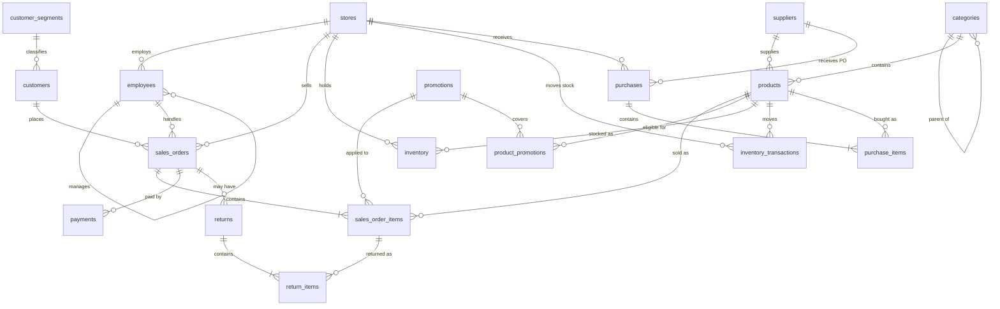

# Entity Relationship Diagram

Renders automatically on GitHub (Mermaid). Crow's-foot notation: `||--o{` means "one to zero-or-many".

## Relationship types

| Type | Relationship | Implemented by |
|---|---|---|
| One-to-many | segment → customers, category → products, supplier → products, store → employees, customer → orders, store → orders, order → items, order → payments, order → returns, return → return items, purchase → purchase items | FK on the "many" side |
| Many-to-many | products ↔ promotions | junction table `product_promotions` (composite PK) |
| Many-to-many | products ↔ stores (stock) | `inventory` (UNIQUE store_id + product_id) |
| Many-to-many | orders ↔ products | `sales_order_items` (UNIQUE order_id + product_id) |
| Many-to-many | purchases ↔ products | `purchase_items` |
| Self-reference | category hierarchy, employee → manager | FK to same table |
| One-to-one | *none enforced.* `inventory` is 1:1 with a (store, product) pair, enforced by a UNIQUE constraint | — |
| Polymorphic (no FK) | `inventory_transactions.reference_id` points to a purchase, sales order or return depending on `reference_type` | documented, checked in data-quality queries |

`dim_date` is a standalone calendar table, joined on date for Power BI time intelligence.
